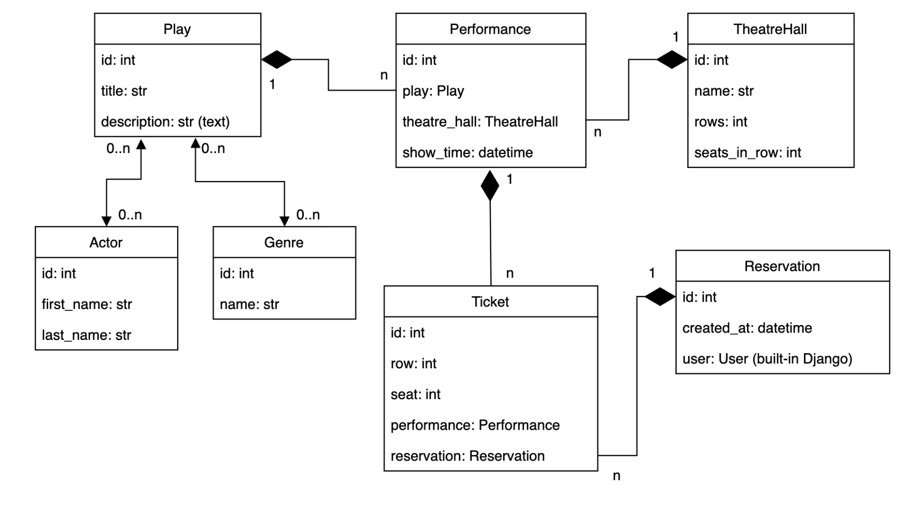

# Theatre-API-service

Theatre-API-service provides endpoints for managing theatre service.

### Features:
- CRUD operations for performances, plays, actors, genres, theatre halls etc.
- Ticket validation based on seat availability.


## Installation

1. Clone the repository:

   ```
   git clone https://github.com/Dimdimior/Theater-api-service/
   ```

2. Create .env file and define environmental variables using .env.sample as an example:
   ```
   SECRET_key=" your django secret key "
   POSTGRES_HOST= your db host
   POSTGRES_DB= name of your db
   POSTGRES_USER= username of your db user
   POSTGRES_PASSWORD= your db password
   
   ```

3. Run command:
   ```
   docker-compose up --build
   ```
4. App will be available at: ```127.0.0.1:8000```
5. Login using next credentials:
   ```
   test@test.com
   1111test
   ```
## Endpoints
   ```
   "theatre" : 
                "http://127.0.0.1:8000/api/theatre/genres/"
                "http://127.0.0.1:8000/api/theatre/actors/"
                "http://127.0.0.1:8000/api/theatre/plays/"
                "http://127.0.0.1:8000/api/theatre/theatre_halls/"
                "http://127.0.0.1:8000/api/theatre/performances/"
                "http://127.0.0.1:8000/api/theatre/reservations/"
   "user" : 
                   "http://127.0.0.1:8000/api/user/register/"
                   "http://127.0.0.1:8000/api/user/me/"
                   "http://127.0.0.1:8000/api/user/token/"
                   "http://127.0.0.1:8000/api/user/token/refresh/"
   "documentation": 
                   "http://127.0.0.1:8000/api/doc/"
                   "http://127.0.0.1:8000/api/swagger/"
                   "http://127.0.0.1:8000/api/redoc/"
   ```

## Schema

